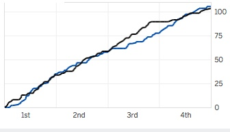

```{r global_options, include=FALSE}
knitr::opts_chunk$set(fig.pos='H')
```

\pagenumbering{gobble}

###Work with a partner to complete the tasks below and submit your results via a pull request on GitHub by the beginning of tutorial next Friday.

To begin this week, one of the partners should fork the TA's Exercise 6 Github repo and provide collaborative access to the other partner. Clone the forked repo so that you have the required files. Be sure to commit regularly to avoid merge conflicts and demonstrate effort by both partners.

&nbsp;

1\. Analysis of data surrounding sports teams has grown into a major business for the teams themselves and the media. One cool summary plot that media outlets generate to summarize a game, in this case basketball, is a line graph depicting the cumulative score for each team as a function of time in the game (see below). 

```{r,out.width="200px",echo=FALSE}

```

I first saw this plot a number of years ago when reading about the results of a game where the University of Wisconsin (Go Badgers!) played Michigan State University. Using the score-by-score information from this game summarized in "UWvMSU_1-22-13.txt" generate a graph similar to the one I show above. Don't worry about how pretty your graph is. Focus more on the control structures required in your script used to generate the plot.

**A couple tips on this one:**

  - You'll want to generate an array or dataframe with a cumulative score for each time whenever either team scores.
  
  - For plotting purposes, keep it simple. The easiest way to make a plot with two lines is to use the `plot()` function in the `matplotlib.pyplot` package. You'll need a line in your script to import the package (`import matplotlib.pyplot as plt`). Then when you want to plot use the `plot` function with the following syntax `plt.plot(time,UWscore,'r-',time,MSUscore,'g-')`, where time is the time column of your array or dataframe and UW and MSU refer to the cumulative scores for each time in your array or dataframe.`r-` and `g-` indicate solid red and green lines, respectively.

&nbsp;

2\. Write a game called "guess my number". The computer will generate a random number between 1 and 100. The user types in a number and the computer replies "lower" if the random number is lower than the guess, "higher" if the random number is higher, and "correct!" if the guess is correct. The player can continue guessing until they get it right.

Here's an example game where the random number is 79. User inputs are *italicized*.

`I'm thinking of a number 1-100...`

`Guess:` *40*

`Higher`

`Guess:` *70*

`Higher`

`Guess:` *80*

`Lower`

`Guess:` *77*

`Higher`

`Guess:` *79*

`Correct!`

**A couple tips on this one:**

  - take a look at the Input/Output reference I gave you for how to get input from the user
  
  - `numpy.random.choice()` is a function that allows for a random selection from a 1D array; you'll have to import `numpy` to use this function
  
  - Check out while loops for this application
    
    + unlike a for loop that loops over a set, a while loop continues "while" a condition is true and exits the loop once the logic test is false
    
    + `while logic test:` is the syntax to begin a while loop and then any actions within the loop should come on subsequent tabbed lines
    
    + there is the possibility of entering what is called an "infinite loop" when using a while loop. In the case of a while loop, an infinite loop goes on forever because by definition the logic test will always be true. To end such a problem, in IPython and Rodeo typing ctrl-c will break you out of the loop.

&nbsp;

&nbsp;

Devise a plan for splitting up the work and generating the required code. Do this in parrallel, not sequentially. Don't forget to check and edit each other's code. Remember to frequently `add`-`commit` locally and `push`-`pull` to GitHub to avoid conflicts. Also, remember you don't have to be in the same place at the same time to work on this collaboratively thanks to GitHub!!!

##Turning in your assignment via GitHub

Once you have committed all changes to your local Git repos and pushed all of those commits to the forked repo on GitHub, you can "turn in" your assignment using a `pull request`. This can be done from the GitHub repo website. When viewing the forked repo, select "Pull requests" in the upper middle of the screen, then click the green "New pull request" button in the upper right. You'll then see a screen with a history of commits for you and your collaborator, select the green "Create pull request button". In the text box next to your user icon near the top of the page, remove whatever text is there and add "owner's last name - collaborator's last name submission", but obviously substitute your last names. If I and Ann Raiho worked on the project together the text would read "jones-raiho submission". Then click the green "Create pull request" button. **Only one of you will need to create a pull request.**